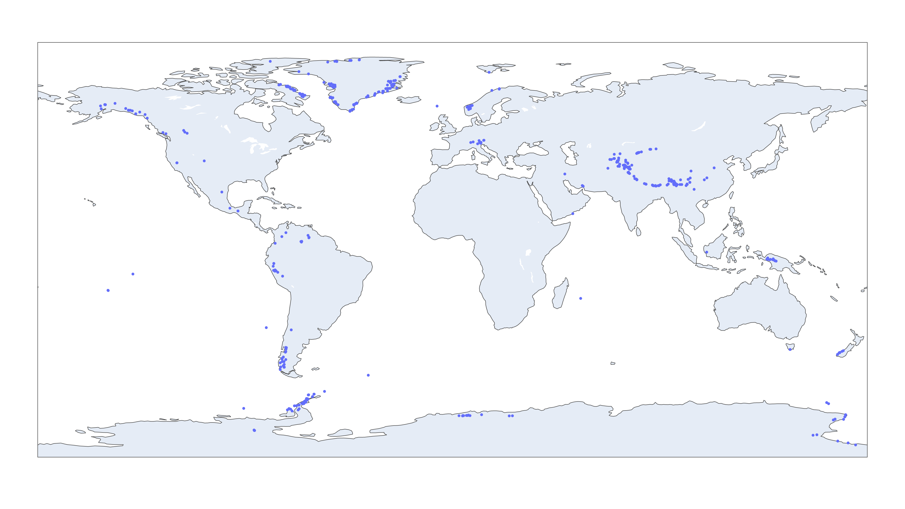
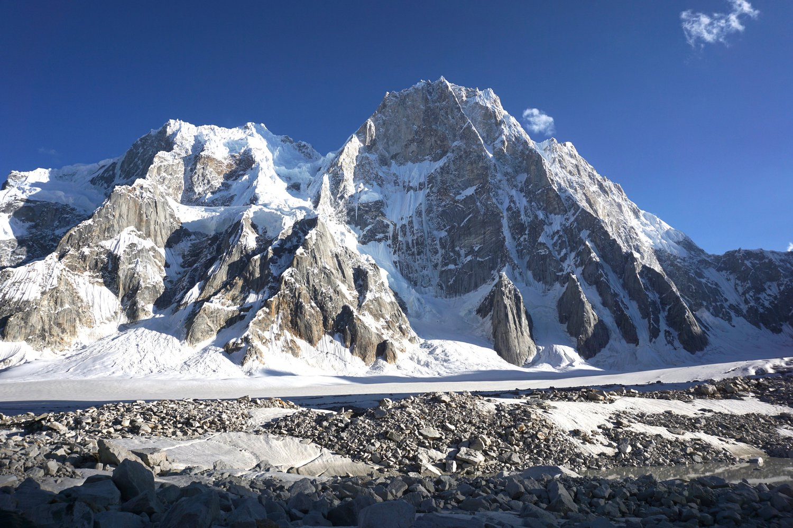
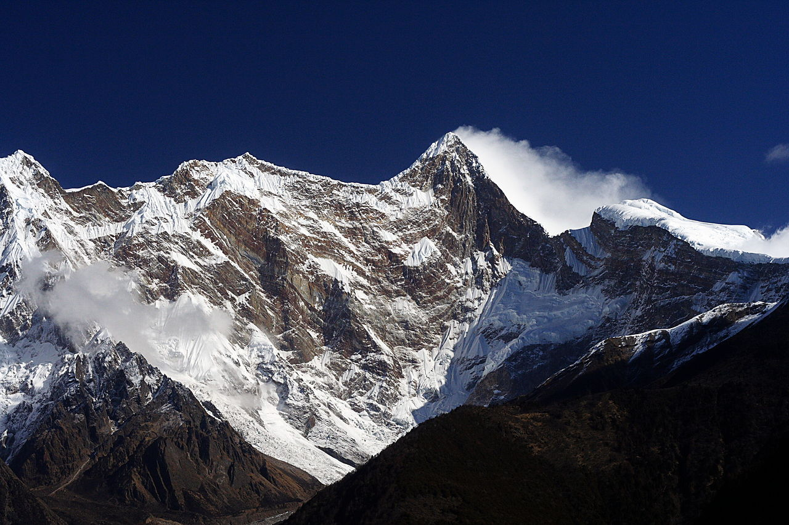
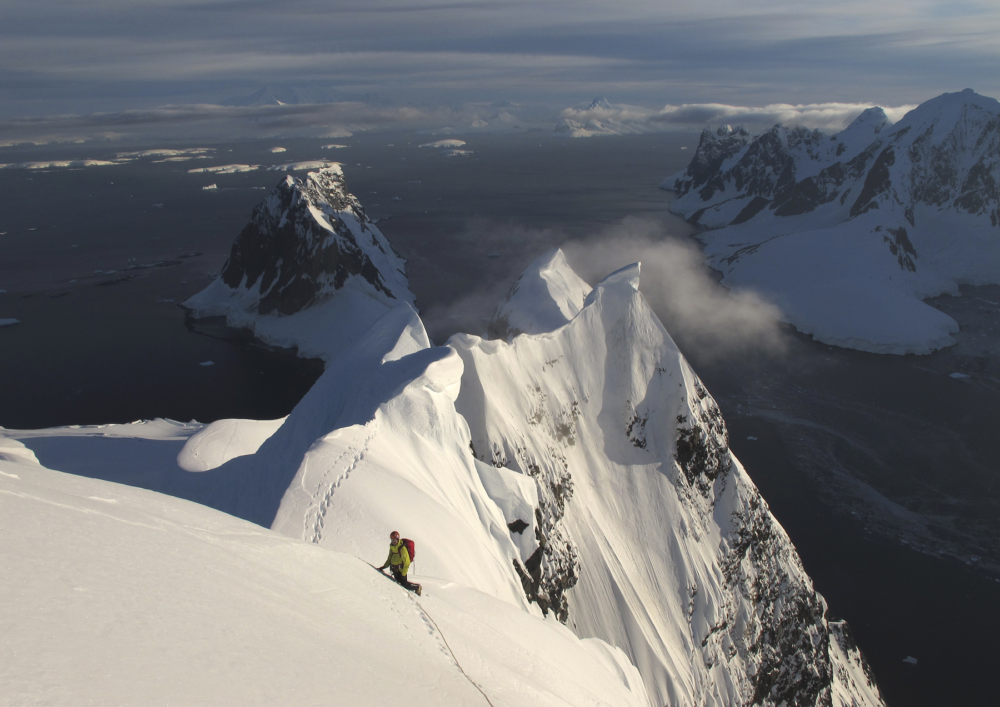
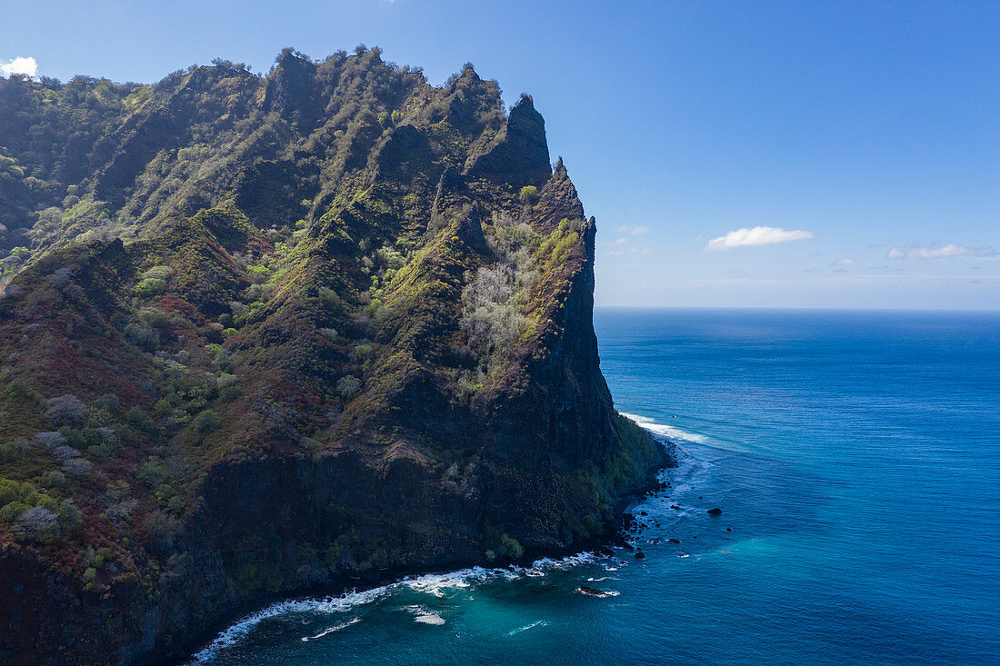
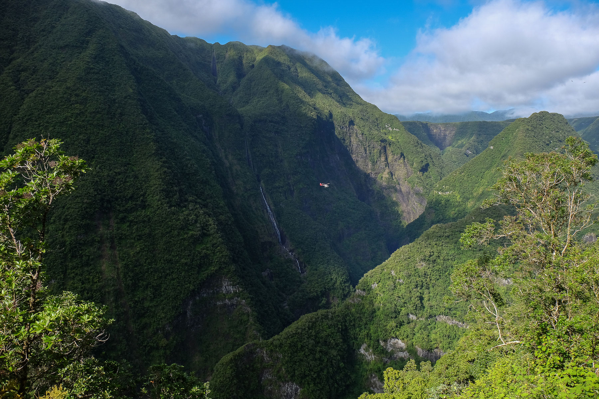
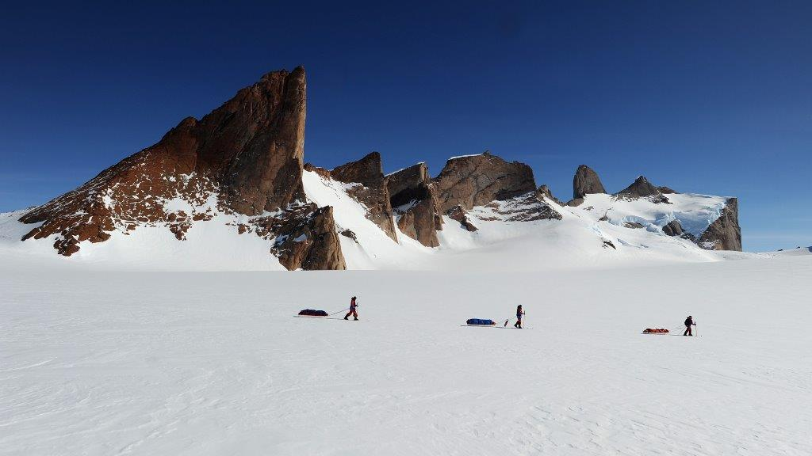
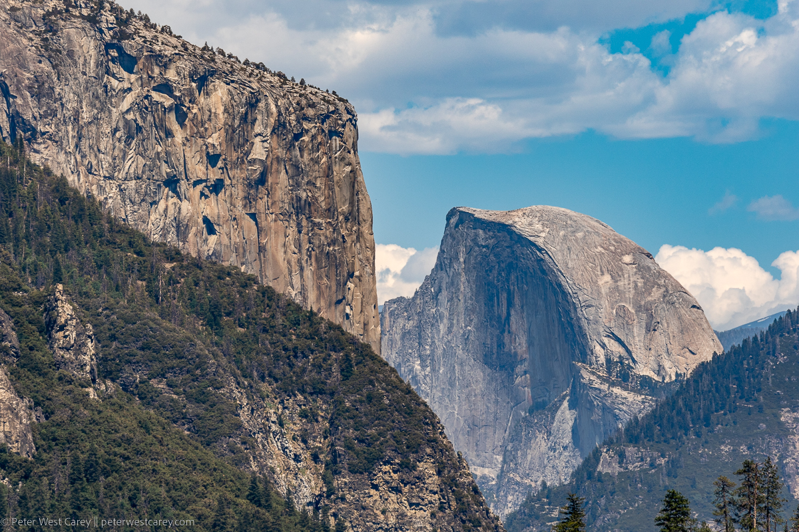

# cliff-finder, world's best finder of cliffs
Interactive map: [https://haraschax.github.io/cliff-finder/](https://haraschax.github.io/cliff-finder/)

I like cliffs, they look cool. If you're a lover of cliffs you may also be annoyed by the lack of rigorous cataloguing and recordkeeping of the world's tallest/steepest cliffs. Wikipedia entries and others are polluted with inflated metrics and cliffs that are conveniently close to populated areas. This repo finds cliffs through an objective analysis of world topographic maps. Many of the world's most extreme cliffs are not close to civilation, are not well documented if documented at all. Some may have never even be photographed.

This repo uses the [Copernicus GLO-30](https://portal.opentopography.org/raster?opentopoID=OTSDEM.032021.4326.3) dataset. It's the most accurate free dataset that I could find. It still has numerous flaws but far less than ASTER, ALOS, SRTM, and others I could find.


The above image is a map of all cliffs over 600m tall. Cliffs are defined here as an average slope of over 300%, though I'll be happy to use a different definition if anyone has strong arguments.

# How to use
install the needed packages and then run the download script (~1.5T of data) and run the search (2hrs on my machine):
```
cd cliff-finder
./dl_copernicus_glo30.sh
./find_cliffs.py
```
This will output a list of cliffs found, and a topographic map of each cliffs in `cliffs_found`

# Some cool cliffs this algorithm found
### Latok I, Pakistan, 35°55'50.9"N 75°49'26.6"E
The north face of Latok 1 shows a 300%+ grade for 1900m of elevation change according to cliff-finder. Which would make it the tallest cliff in the world. The total height change from the cliff peak to valley right in front of it is ~2300m.


### Namcha Barwa, China, 29°37'14.8"N 95°02'12.6"E


### Mount Foster, Antarctica, 63°00'25.7"S 62°35'14.6"W


### Cerro Duida, Venezuela, 3°20'10.9"N 65°33'15.2"W
Deep in the venezuelan jungle. Over 100km from the closest road lies Cerro Duida. A large plateau mountain with close to 1000m cliffs all around.


### Fatu Hiva's sea cliffs, French Polynesia, 10°31'30.9"S 138°41'03.5"W


### Takamaka valley, Reunion, 21°05'49.5"S 55°37'13.6"E


### Antarctica, Filchner Mountains, 71°58'36.2"S 7°35'47.9"E


### Schiben, Switzerland, 46°48'59.6"N 8°57'52.4"E


### Half Dome and El Capitan in Yosemite, USA, 37°44'41.5"N 119°32'10.3"W and 37°43'48.0"N 119°38'11.0"W
Both Yosemite's famous cliff walls show up with cliff-finder too

